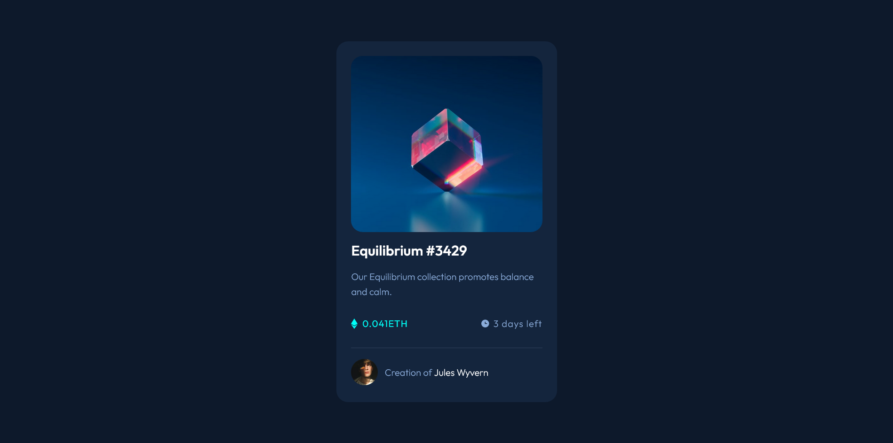

# Frontend Mentor - NFT preview card component solution

This is a solution to the [NFT preview card component challenge on Frontend Mentor](https://www.frontendmentor.io/challenges/nft-preview-card-component-SbdUL_w0U). Frontend Mentor challenges help you improve your coding skills by building realistic projects. 

## Table of contents

- [Overview](#overview)
  - [The challenge](#the-challenge)
  - [Screenshot](#screenshot)
  - [Links](#links)
- [My process](#my-process)
  - [Built with](#built-with)
  - [What I learned](#what-i-learned)
  - [Useful resources](#useful-resources)
- [Author](#author)

## Overview
 Card with hover effects etc, made with plain HTML & CSS
### The challenge

Users should be able to:

- View the optimal layout depending on their device's screen size
- See hover states for interactive elements

### Screenshot

### Links

- Solution URL: [here](https://github.com/pilatech/nft-card-component)
- Live Site URL: [here](https://nft-card-component-by-pilate.netlify.app)

## My process
- Created Markup concerning myself with semantics at the same time being considerate about the final visual look
- wrote css from top to bottom i.e following the order of the markup

### Built with

- Semantic HTML5 markup
- CSS custom properties
- Flexbox
- Mobile-first workflow

### What I learned

I had fun getting to understand multiple (stacked) backgrounds better

### Useful resources

- [Using multiple backgrounds in CSS](https://www.webucator.com/article/how-to-use-multiple-background-images-with-css/) - This article had a great explanation of the concept of stacked backgrounds.

## Author

- Website - [Pilate Chinyengetere](https://www.twitter.com/pchinyengetere)
- Frontend Mentor - [@pilatech](https://www.frontendmentor.io/profile/pilatech)
- Twitter - [@pchinyengetere](https://www.twitter.com/pchinyengetere)